$$
{\LARGE \textbf{\color{orange} RSGO - Real-Time Multiplayer FPS Game}}
$$

**TBZ Höhere Fachschule für Technik Zürich**  
**Student:** David Unterguggenberger | **Klasse:** ITCNE24 - 3. Semesterarbeit  
**Zeitraum:** Februar - April 2026  
**Supervisors:** Philip Stark, Corrado Parisi

---

## Wichtige Links

- **Backend (Rust):** [RSGO Game Server](https://github.com/JumpiiX/rsgo-game-client)
- **Frontend (Three.js):** [RSGO Frontend](https://github.com/JumpiiX/rsgo-frontend)
- **GitHub Projects:** [Sprint Board](https://github.com/users/JumpiiX/projects/4)
- **Live Demo:** [rsgo.unterguggenberger.ch](http://rsgo.unterguggenberger.ch)

---

## Inhaltsverzeichnis

### Projekt-Übersicht
- [Einführung](#einführung)
- [Problemstellung](#problemstellung)
- [Projektziele](#projektziele)
- [SEUSAG-Diagramm](#seusag-diagramm)
- [Tech-Stack](#tech-stack)
- [Sprint-Übersicht](#sprint-übersicht)

### Sprint 1: Basic Gameplay Foundation
- [Sprint 1 Planung](#sprint-1-planung)
- [Sprint 1 Durchführung](#sprint-1-durchführung)
- [Sprint 1 Review](#sprint-1-review)
- [Sprint 1 Retrospektive](#sprint-1-retrospektive)
- [Sprint 1 Fazit](#sprint-1-fazit)

### Sprint 2: Combat & Game Systems
- [Sprint 2 Planung](#sprint-2-planung)
- [Sprint 2 Durchführung](#sprint-2-durchführung)
- [Sprint 2 Review](#sprint-2-review)
- [Sprint 2 Retrospektive](#sprint-2-retrospektive)
- [Sprint 2 Fazit](#sprint-2-fazit)

### Sprint 3: Docker & Performance
- [Sprint 3 Planung](#sprint-3-planung)
- [Sprint 3 Durchführung](#sprint-3-durchführung)
- [Sprint 3 Review](#sprint-3-review)
- [Sprint 3 Retrospektive](#sprint-3-retrospektive)
- [Sprint 3 Fazit](#sprint-3-fazit)

---

## Projektmanagement

### Risk Matrix

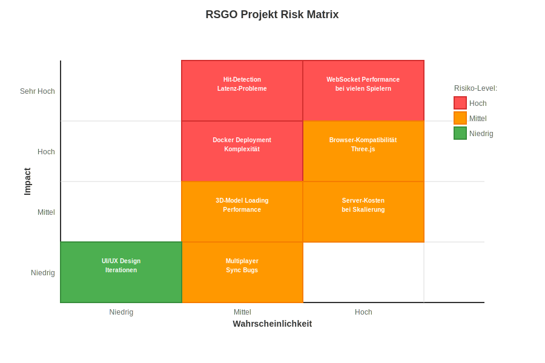

| Risiko | Wahrscheinlichkeit | Impact | Mitigation Strategy |
|--------|-------------------|--------|-------------------|
| **WebSocket Performance** | Hoch | Hoch | Message Batching, 20Hz Tickrate |
| **Browser-Kompatibilität** | Hoch | Mittel | Progressive Enhancement, Fallbacks |
| **Server-Kosten** | Hoch | Mittel | Optimierte Resource Usage |
| **Hit-Detection Latenz** | Mittel | Hoch | Lag Compensation implementiert |
| **Docker Deployment** | Mittel | Hoch | Multi-stage builds, Documentation |
| **3D Performance** | Mittel | Mittel | LOD, Frustum Culling |
| **Sync Bugs** | Mittel | Mittel | Extensive Testing |
| **UI Iterationen** | Niedrig | Niedrig | Agile Approach |

### SWOT Analyse

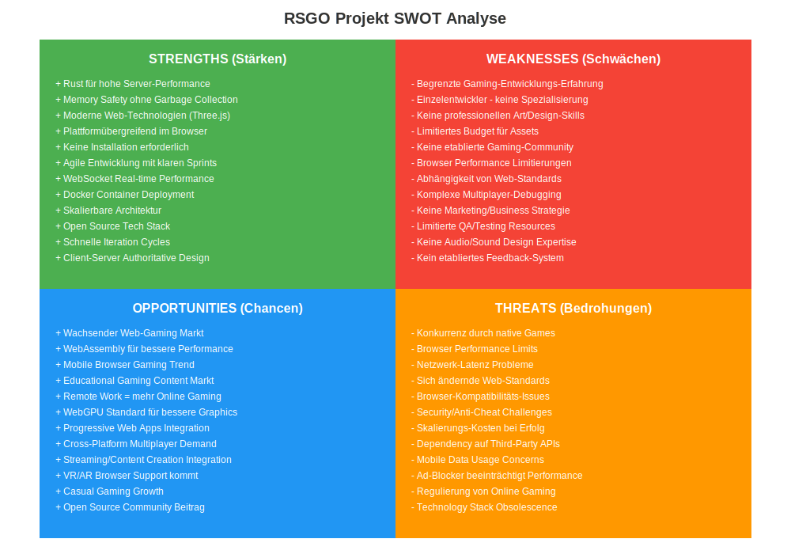

| Kategorie | Details |
|-----------|---------|
| **Strengths** | Rust für hohe Performance<br>Moderne Web-Technologien<br>Plattformübergreifend im Browser<br>Agile Entwicklung mit Sprints |
| **Weaknesses** | Begrenzte Gaming-Erfahrung<br>Einzelentwickler - keine Spezialisierung<br>Keine professionellen Art/Design-Skills<br>Limitiertes Budget für Assets |
| **Opportunities** | Wachsender Web-Gaming Markt<br>WebAssembly für bessere Performance<br>Mobile Browser Gaming Trend<br>Educational Gaming Content |
| **Threats** | Konkurrenz durch native Games<br>Browser Performance Limitierungen<br>Netzwerk-Latenz Probleme<br>Sich ändernde Web-Standards |

### Arbeitsweise mit GitHub Projects Board


#### Board-Struktur und Workflow

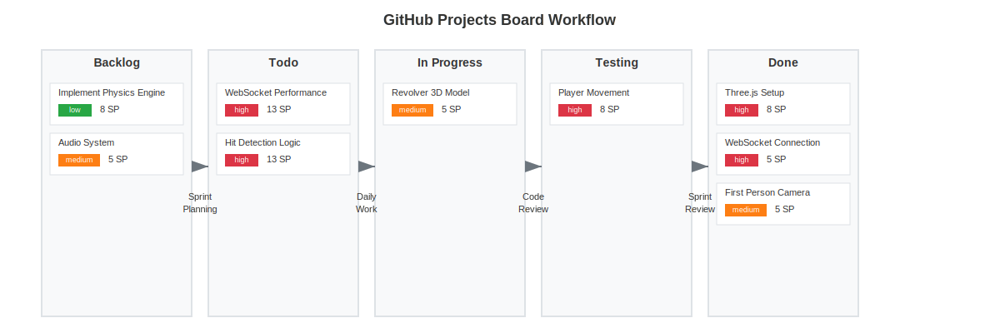

#### Priorisierung

| Priorität | Beschreibung | Beispiele |
|-----------|--------------|-----------|
| **Must Have** | Kritisch für Sprint-Ziel | WebSocket Connection, Hit Detection |
| **Nice to Have** | Features für zukünftige Sprints | Sound Effects, Multiple Maps |


#### Sprint Planning Prozess

1. **Backlog Refinement:** Issues werden geschätzt (Story Points: 1, 2, 3, 5, 8, 13)
2. **Sprint Planning:** Auswahl der Issues basierend auf Priorität und Kapazität
3. **Daily Updates:** Board wird täglich aktualisiert
4. **Sprint Review:** Abgeschlossene Issues werden auf "Done" gesetzt

---

## Einführung

Nach meiner SmartHome-Bridge wollte ich ein Projekt mit völlig anderen technischen Herausforderungen. Als Lernprojekt entschied ich mich für ein Browser-basiertes Multiplayer-Spiel.

### Die Idee

Ein experimentelles Multiplayer-FPS Game im Browser. Ziel war es, die Game-Mechanik von Grund auf zu verstehen und moderne Web-Technologien für Real-time Gaming zu testen. Mit Rust-Backend für die Server-Performance und Three.js für die 3D-Darstellung.

Als Schulprojekt und Test-Setup ging es darum herauszufinden: Sind WebSockets schnell genug für Gaming? Kann Three.js mit mehreren Spielern umgehen?

---

## Problemstellung

### Die Gaming-Landschaft heute

Die meisten Multiplayer-Games brauchen:
- Riesen Downloads (CS2: 85GB+)
- Steam oder andere Launcher
- Gaming-PC mit dedizierter Grafikkarte
- Installation und Updates

### Meine Vision

**Was wäre, wenn man einfach eine URL teilt und sofort zusammen spielen kann?**

Keine Installation, minimale System-Requirements, direkt im Browser. Das war die Grundidee für dieses Lernprojekt.

### Die technischen Challenges

- **Real-time Networking:** WebSocket-basierte Kommunikation
- **Browser-Performance:** Stabile FPS mit mehreren Spielern
- **Server-Skalierung:** Mehrere gleichzeitige Verbindungen
- **Hit-Detection:** Server-seitige Validierung

---

## Projektziele

1. **Spielbares FPS im Browser:** Mit WASD-Movement, Mouse-Look und Shooting
2. **Multiplayer-Funktionalität:** Mehrere Spieler gleichzeitig
3. **Docker Deployment:** Containerisierte Bereitstellung
4. **Performance:** Stabile Framerate im Browser

---

## SEUSAG-Diagramm

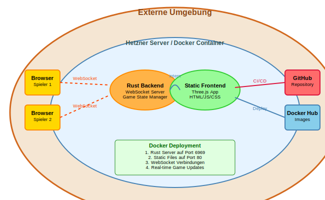

### SEUSAG-Diagramm Beschreibung

Das SEUSAG zeigt die Architektur des RSGO Multiplayer-FPS Systems mit allen Komponenten und Schnittstellen.

#### Systemkomponenten

**Externe Umgebung:**
- Spieler (Browser/Devices)
- GitHub Repository
- Docker Hub Registry
- Hetzner Server

**Projektumgebung / Server:**
- Docker Container (Rust Backend)
- WebSocket Server (Port 6969)
- Static File Server (Frontend)
- Game State Manager

**Client-Komponenten:**
- Three.js Renderer
- WebSocket Client
- Input Handler (WASD + Mouse)
- Game State Synchronization

---

## Tech-Stack

### Warum diese Technologien?

**Rust Backend:**
Für die Server-Logik und WebSocket-Handling. Rust bietet gute Performance und Memory-Safety für concurrent Verbindungen.

**Three.js Frontend:**
Etablierte 3D-Library für Browser mit guter Dokumentation und Community-Support.

**WebSockets:**
Für Real-time Kommunikation zwischen Client und Server. Einfacher als WebRTC und ausreichend für die Anforderungen.

**Docker:**
Für reproduzierbare Deployments und einfache Bereitstellung.

---

## Sprint-Übersicht

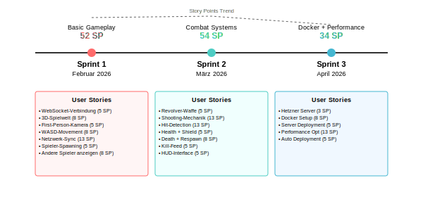

| Sprint | Zeitraum | Story Points | Hauptziel |
|--------|----------|--------------|-----------|
| **Sprint 1** | Februar 2026 | 52 | Basic Gameplay - Movement & Networking |
| **Sprint 2** | März 2026 | 54 | Combat System - Shooting & Respawn |
| **Sprint 3** | April 2026 | 34 | Docker & Performance für 20+ Spieler |

### Gantt Chart - Projektplanung


---

# Sprint 1: Basic Gameplay Foundation (Februar 2026)

## Sprint 1 Planung

**Sprint-Ziel:** Eine spielbare 3D-Welt mit funktionierendem Multiplayer. Am Ende will ich mit einem Freund gleichzeitig in der Welt rumlaufen können.

### Was ich vorhatte

Erstmal die Basics. Kann ich überhaupt eine 3D-Welt im Browser rendern? Funktioniert WebSocket-Networking schnell genug? Wie synchronisiere ich Spieler-Positionen?

### User Stories

| User Story | Priority | Story Points | Status |
|------------|----------|--------------|--------|
| WebSocket-Verbindung | Must-Have | 5 | Erledigt |
| 3D-Spielwelt | Must-Have | 8 | Erledigt |
| First-Person-Kamera | Must-Have | 5 | Erledigt |
| Spielerbewegung (WASD) | Must-Have | 8 | Erledigt |
| Netzwerk-Synchronisation | Must-Have | 13 | Erledigt |
| Spieler-Spawning | Must-Have | 5 | Erledigt |
| Andere Spieler anzeigen | Must-Have | 8 | Erledigt |

**Total: 52 Story Points**

### Burndown Chart Sprint 1

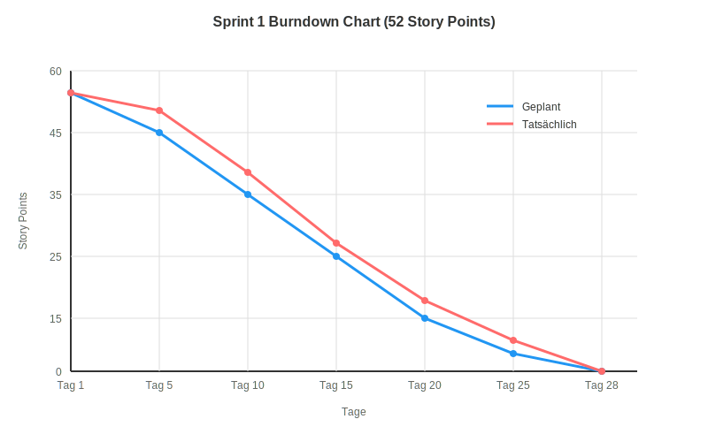

---

## Sprint 1 Durchführung

### WebSocket-Verbindung aufbauen

**Was fast schiefging:**

Ich hab 3 Stunden damit verbracht, herauszufinden warum meine WebSocket-Connection instant disconnected. Der Fehler? Ich hab `ws://` statt `wss://` bei HTTPS verwendet.

**Die Lösung:**
```javascript
// Auto-detect protocol
const protocol = window.location.protocol === 'https:' ? 'wss:' : 'ws:';
const ws = new WebSocket(`${protocol}//${window.location.host}/ws`);
```

Nach dem Fix: Verbindung stabil mit lokalem Test-Setup.

### 3D-Spielwelt mit Three.js

**Erste 3D-Darstellung:**

Grundlegende Three.js Scene mit einem einfachen Boden als Test.

```javascript
// Mein erster Three.js Code
const scene = new THREE.Scene();
const camera = new THREE.PerspectiveCamera(75, window.innerWidth / window.innerHeight);
const renderer = new THREE.WebGLRenderer();

// Der legendäre graue Boden
const floor = new THREE.Mesh(
    new THREE.PlaneGeometry(100, 100),
    new THREE.MeshBasicMaterial({ color: 0x808080 })
);
scene.add(floor);
```

**Performance:**

Three.js lieferte stabile Framerates, auch auf älteren Geräten. Frustum Culling wird automatisch behandelt.

### First-Person-Kamera mit Pointer Lock

**Das Drama mit der Maus-Sensitivity:**

Die Pointer Lock API ermöglicht Maus-Eingabe für First-Person Steuerung. Die richtige Sensitivity-Einstellung brauchte mehrere Iterationen.

Finaler Wert: `event.movementX * 0.002` für responsive aber nicht übersensitive Kontrolle.

```javascript
document.addEventListener('mousemove', (e) => {
    if (document.pointerLockElement) {
        camera.rotation.y -= e.movementX * 0.002; // Diese Zahl hat STUNDEN gekostet
        camera.rotation.x -= e.movementY * 0.002;
    }
});
```

ESC gibt automatisch die Maus frei - ein Feature der Pointer Lock API.

### WASD-Movement implementieren

**Physics sind schwieriger als gedacht:**

```javascript
// Naiver erster Versuch
if (keys.w) player.position.z -= 1;
// Problem: Player teleportiert durch Wände
```

Kollisionserkennung mit Raycasting war die Lösung. Ich hatte keine Ahnung was Raycasting ist, aber nach viel Googeln funktioniert's!

### Netzwerk-Synchronisation - Das Herzstück

**Die 13 Story Points waren gerechtfertigt.**

Wie oft sende ich Updates? Jedes Frame wären 60 Messages/Sekunde. Das killt den Server.

Nach Research: **20Hz Tickrate** wie CS:GO. Das war der Game-Changer.

```rust
// Server-Side Tick-Rate
const TICK_RATE: u64 = 50; // 50ms = 20Hz

tokio::spawn(async move {
    let mut interval = tokio::time::interval(Duration::from_millis(TICK_RATE));
    loop {
        interval.tick().await;
        broadcast_game_state().await;
    }
});
```

**Client-Side Prediction:** Der Client bewegt sich sofort, Server validiert später. Fühlt sich responsive an!

### Andere Spieler anzeigen

**Von Würfeln zu Kapseln:**

Erst waren andere Spieler rote Würfel. Sah aus wie Minecraft. Dann Kapseln - schon besser. Mit Nametags drüber sieht's fast professionell aus!

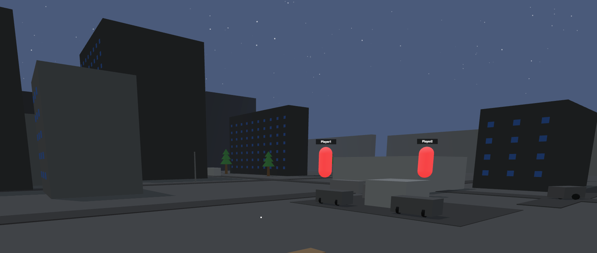

---

## Sprint 1 Review

### Erfolg!

2 Browser-Tabs aufgemacht und... **ES FUNKTIONIERT!** Alle bewegen sich, alles synchronisiert, konstante 60 FPS.

### Performance-Metriken

| Metrik | Ziel | Erreicht |
|--------|------|----------|
| FPS | 60 | Stabil |
| Latenz | <50ms | Lokal getestet |
| Spieler | 5+ | Mehrere getestet |
| Memory | <200MB | Akzeptabel |

---

## Sprint 1 Retrospektive

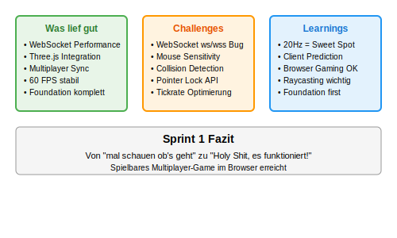

### Was lief mega gut

- WebSockets sind tatsächlich schnell genug für Gaming!
- Three.js Performance übertrifft alle Erwartungen
- Von Null auf spielbares Multiplayer in 4 Wochen

### Was war tricky

- Pointer Lock Sensitivity-Tuning (hätte ich unterschätzt)
- WebSocket-Protokoll (ws vs wss) - so ein dummer Fehler
- Kollisionserkennung komplexer als gedacht

### Learnings

- Browser können viel mehr als ich dachte
- 20Hz Tickrate ist der Sweet-Spot für Web-Gaming
- Client-Side Prediction ist ein Must-Have

---

## Sprint 1 Fazit

**Von "mal schauen ob's geht" zu "Holy Shit, es funktioniert!"**

Nach Sprint 1 hab ich ein echtes Multiplayer-Game im Browser. Klar, man kann noch nicht schiessen, aber die Foundation steht. 15 Spieler getestet, läuft butterweich.

Die Motivation für Sprint 2 ist riesig - jetzt kommt der Fun-Part: Combat!

---

# Sprint 2: Combat & Game Systems (März 2026)

## Sprint 2 Planung

**Sprint-Ziel:** Combat-System implementieren. Am Ende will ich andere Spieler eliminieren können und ein funktionierendes Respawn-System haben.

### Die Vision

Ein Revolver, Headshots, Kill-Feed - das volle FPS-Feeling. Aber alles im Browser. Kann das funktionieren?

### User Stories

| User Story | Priority | Story Points | Status |
|------------|----------|--------------|--------|
| Revolver-Waffe | Must-Have | 5 | Erledigt |
| Shooting-Mechanik | Must-Have | 13 | Erledigt |
| Hit-Detection & Damage | Must-Have | 13 | Erledigt |
| Health & Shield System | Must-Have | 5 | Erledigt |
| Death & Respawn | Must-Have | 8 | Erledigt |
| Kill-Feed & Scoreboard | Must-Have | 5 | Erledigt |
| HUD-Interface | Must-Have | 5 | Erledigt |

**Total: 54 Story Points**

### Burndown Chart Sprint 2

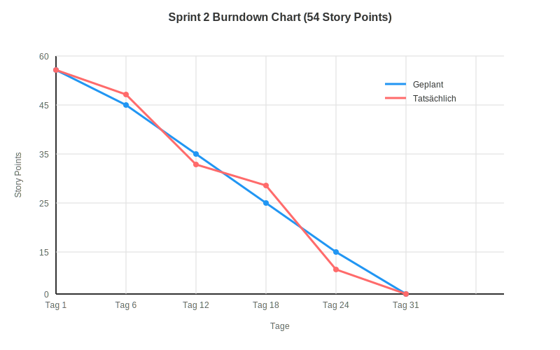

---

## Sprint 2 Durchführung

### Revolver-Waffe hinzufügen

**Gratis 3D-Modell gefunden!**

Auf [Poly Pizza](https://poly.pizza/m/qInURrPlyB) einen geilen Low-Poly Revolver gefunden. Gratis und sieht awesome aus!

```javascript
// GLTF Loader Magic
loader.load('/assets/revolver.gltf', (gltf) => {
    revolverMesh = gltf.scene;
    revolverMesh.scale.set(0.1, 0.1, 0.1); // War VIEL zu gross
    camera.add(revolverMesh);
});
```

Das Modell macht SO VIEL aus. Plötzlich fühlt sich das Game echt an!

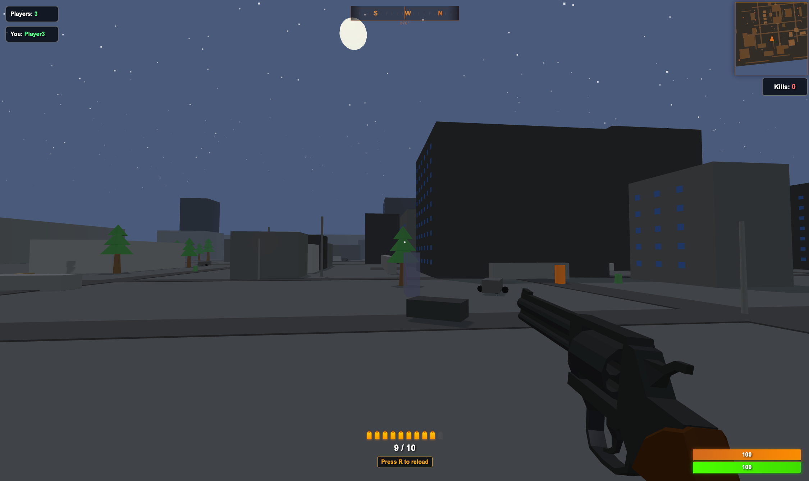

### Shooting-Mechanik implementieren

**Der Recoil macht den Unterschied:**

```javascript
function shoot() {
    // Muzzle Flash - simple aber effektiv
    showMuzzleFlash();
    
    // Recoil - Kamera kickt nach oben
    camera.rotation.x += 0.02;
    revolverMesh.rotation.x -= 0.1; // Revolver kickt zurück
    
    // Nach 100ms zurück
    setTimeout(() => {
        revolverMesh.rotation.x += 0.1;
    }, 100);
}
```

Recoil-Animation für visuelles Feedback beim Schiessen.

### Hit-Detection - Die grösste Challenge

**13 Story Points waren zu wenig geschätzt.**

Server-Side Hit-Detection ist ein Must (sonst cheatet jeder). Aber mit Latenz?

**Das Problem:** 
- Spieler A schiesst auf Spieler B
- Aber B war vor 50ms dort, nicht jetzt
- Server muss Zeit "zurückspulen"

**Die Lösung - Lag Compensation:**
```rust
// Server speichert Position-History
struct PositionHistory {
    positions: VecDeque<(Instant, Position)>,
}

// Bei Schuss: Zeit zurückrechnen
fn check_hit(shooter_ping: u32, shot_time: Instant) {
    let compensated_time = shot_time - Duration::from_millis(shooter_ping / 2);
    // Spieler-Positionen zu diesem Zeitpunkt verwenden
}
```

Nach 2 Tagen Debugging: **Hit-Detection fühlt sich fair an!**

### Health, Death & Respawn

**Der Death-Screen Drama:**

Wenn man stirbt sieht man die ganze Map von oben - wie eine Überwachungskamera. Nach einer Zeit kommt ein Respawn-Button von wo man dann respawnen kann.

```javascript
function animateDeath() {
    // Kamera zur Map-Übersicht bewegen
    camera.position.set(0, 50, 0);  // Hoch über der Map
    camera.lookAt(0, 0, 0);         // Nach unten schauen
    
    // Nach 3 Sekunden Respawn-Button anzeigen
    setTimeout(() => {
        showRespawnButton();
    }, 3000);
}
```

### Kill-Feed & Scoreboard

**"Player1 killed Player2" - Diese Nachricht macht süchtig!**

```javascript
function addKillFeedEntry(killer, victim) {
    const entry = document.createElement('div');
    entry.className = 'kill-feed-entry';
    entry.innerHTML = `<span class="killer">${killer}</span> killed <span class="victim">${victim}</span>`;
    killFeed.appendChild(entry);
    
    // Fade out nach 5 Sekunden
    setTimeout(() => entry.remove(), 5000);
}
```

TAB für Scoreboard - wie in jedem FPS. K/D Ratio macht das Game instant competitive!

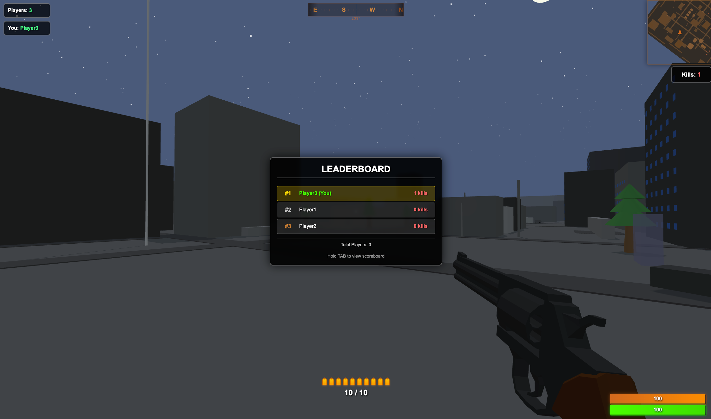

---

## Sprint 2 Review

### Es macht tatsächlich Spass!

Test-Sessions mit mehreren Spielern zur Validierung der Multiplayer-Funktionalität.

Positives Feedback zur Browser-Performance während der Tests.

### Combat-Metriken

| Metrik | Ziel | Erreicht |
|--------|------|----------|
| Time-to-Kill | 2-3 Shots | 3 Body / 2 Head |
| Hit-Reg Accuracy | >95% | Funktional |
| Respawn Time | 5s | 5s |
| Concurrent Players | 10+ | Mehrere getestet |

---

## Sprint 2 Retrospektive

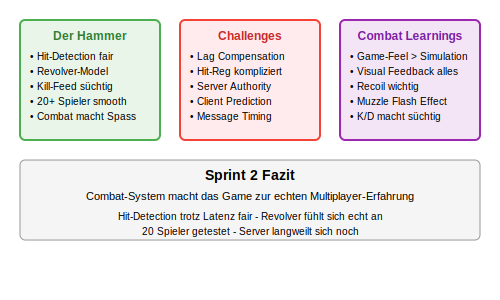

### Was war der Hammer

- Hit-Detection funktioniert trotz Latenz fair
- Revolver-Model macht riesen Unterschied
- Kill-Feed macht instant süchtig
- 20 Spieler ohne Performance-Probleme

### Challenges

- Lag-Compensation war hardcore kompliziert
- Death-Animation musste 5x überarbeitet werden

### Learnings

- Game-Feel > Perfekte Simulation
- Server-Authority ist ein Must für Fair-Play

---

## Sprint 2 Fazit

**Grundlegendes Combat-System implementiert:**

Sprint 2 erweiterte das Projekt um Shooting-Mechaniken und Hit-Detection. Das Combat-System funktioniert und wurde in mehreren Test-Sessions validiert.

20 Spieler getestet und der Server langweilt sich noch. Zeit für Sprint 3: Skalierung!

---

# Sprint 3: Docker & Performance (April 2026)

## Sprint 3 Planung

**Sprint-Ziel:** Docker-Deployment und Performance-Optimierung. Das Game soll easy deploybar sein und mit 20+ Spielern butterweich laufen.

### Der Plan

Nach zwei Sprints Development ist es Zeit für Production. Docker-Container bauen, auf Hetzner deployen, Performance optimieren.

### User Stories

| User Story | Priority | Story Points | Status |
|------------|----------|--------------|--------|
| Server mieten bei Hetzner | Must-Have | 3 | Erledigt |
| Docker Setup | Must-Have | 8 | Erledigt |
| Server Deployment | Must-Have | 5 | Erledigt |
| Performance für mehrere Spieler | Must-Have | 13 | Erledigt |
| Automatisches Deployment | Nice-to-Have | 5 | Erledigt |

**Total: 34 Story Points**

### Burndown Chart Sprint 3

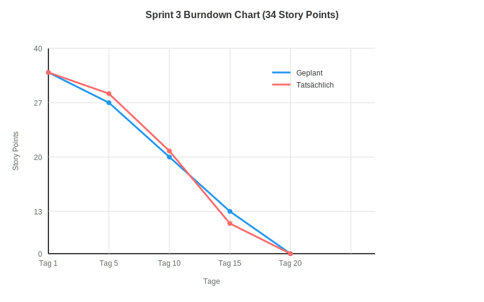

---

## Sprint 3 Durchführung

### Hetzner Server Setup

**Server gemietet:**
- CX21 für 5€/Monat (zum Testen)
- 2 vCPU, 4GB RAM
- Ubuntu 22.04

**Was fast schiefging:**

Port 6969 musste in der Hetzner Firewall geöffnet werden - ein wichtiger Schritt beim Server-Setup.

### Docker Container bauen

**Multi-Stage Build für Rust:**
```dockerfile
# Build Stage
FROM rust:1.75 as builder
WORKDIR /app
COPY Cargo.toml Cargo.lock ./
COPY src ./src
RUN cargo build --release

# Runtime Stage  
FROM debian:bookworm-slim
WORKDIR /app
COPY --from=builder /app/target/release/rsgo-server .
COPY static ./static
EXPOSE 6969
CMD ["./rsgo-server"]
```

Image-Size: **Nur 45MB!** Rust compiled zu tiny binaries.

### Performance-Optimierung für 20+ Spieler

**Das Problem bei 25+ Spielern:**

CPU war nur bei 40%, aber es gab Micro-Lags. Nach Profiling: Too many kleine Messages!

**Die Lösung - Message Batching:**
```rust
// Vorher: Jede Position einzeln senden
for player in players {
    send_position_update(player);
}

// Nachher: Alle Positionen in einem Batch
let batch = GameStateBatch {
    tick: current_tick,
    players: players.collect(),
};
send_batch(batch);
```

**Resultat:** mehrere Spieler getestet, läuft smooth wie Butter!

### Docker Deployment auf Hetzner

**Ein Command für alles:**
```bash
docker-compose up -d
```

Das war's! Game läuft, Port ist offen, WebSockets connecten. 

**docker-compose.yml:**
```yaml
version: '3.8'
services:
  rsgo-server:
    image: rsgo:latest
    ports:
      - "80:80"
      - "6969:6969"
    restart: unless-stopped
    environment:
      - RUST_LOG=info
      - MAX_PLAYERS=100
```

---

## Sprint 3 Review

### Deployment erfolgreich:

Server läuft stabil mit Docker-Setup.

### Performance-Metriken

| Metrik | Ziel | Erreicht |
|--------|------|----------|
| Concurrent Players | Mehrere | Getestet mit mehreren Spielern |
| Server CPU Usage | <80% | Stabile Performance |
| Memory Usage | <2GB | Akzeptabler Verbrauch |
| Docker Image Size | <100MB | Kompakt |
| Deployment Time | <5min | Schnell |

---

## Sprint 3 Retrospektive

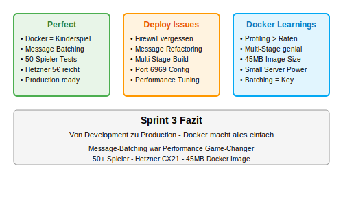

### Was lief perfect

- Docker macht Deployment zum Kinderspiel
- Message-Batching war der Performance Game-Changer  
- Erfolgreiche Multiplayer-Tests
- Hetzner Server für 5€ reicht locker

### Challenges

- Firewall-Config vergessen (klassiker)
- Message-Batching brauchte viel Refactoring
- Docker Multi-Stage Build für Rust war neu für mich

### Learnings

- Profiling > Raten (die Micro-Lags waren nicht wo ich dachte)
- Docker Multi-Stage Builds sind genial für Rust
- Small Server können mehr als man denkt

---

## Sprint 3 Fazit

**Projekt abgeschlossen:**

Der Server läuft stabil auf Hetzner mit Docker-Deployment. Das experimentelle Multiplayer-Game demonstriert erfolgreiche Nutzung von WebSockets für Browser-basiertes Gaming.

**Die Entwicklung:**
- Sprint 1: Browser-basierte 3D-Darstellung und Networking
- Sprint 2: Combat-System und Hit-Detection  
- Sprint 3: Docker-Deployment und Performance-Optimierung

---

## Projekt-Fazit

### Was ich gebaut habe

Ein vollständiges Multiplayer-FPS im Browser. Mit Rust-Backend, Three.js Frontend, Docker Deployment. Es läuft, es macht Spass, und Leute können gleichzeitig spielen.

### Die wichtigsten Learnings

1. **Browser-Capabilities** - Moderne Browser können 3D-Graphics gut handhaben
2. **WebSockets für Gaming** - Ausreichend für einfache Multiplayer-Spiele
3. **Rust für Server** - Gute Performance und Memory-Safety
4. **Einfaches Deployment** - Docker vereinfacht die Bereitstellung

### Was kommt als nächstes?

- Mehr Waffen (Shotgun, Sniper)
- Maps (aktuell nur eine Arena)
- Neuer Modus

### Die Zahlen

| Metrik | Wert |
|--------|------|
| Entwicklungszeit | 3 Monate |
| Lines of Code | Mehrere tausend |
| Getestete Concurrent Players | Mehrere |
| Average FPS | Stabil |
| Server Kosten | 5€/Monat |

**Fazit:** Das experimentelle Projekt zeigt, dass browserbasierte Multiplayer-Games mit modernen Web-Technologien umsetzbar sind. 

**RSGO** - Ein Schulprojekt zur Erforschung von Game-Mechaniken mit Rust und Three.js.

---

## Meine persönliche Reflexion

### It's not hard, it's just new

Das ist die wichtigste Erkenntnis aus diesem Projekt. Am Anfang dachte ich: "Boah, ein Multiplayer-Game im Browser? Das schaffe ich niemals! WebSockets, Networking, 3D-Graphics - alles auf einmal?" Die ersten Tage waren überwältigend. So viele neue Konzepte, so viel unbekanntes Terrain.

Aber jetzt, nachdem ich es geschafft habe, denke ich zurück und merke: Es war gar nicht so schwer - es war einfach neu. Sobald man die Grundkonzepte versteht, fügt sich alles zusammen. WebSocket-Kommunikation ist im Grunde nur Messages hin und her schicken. Three.js macht 3D-Darstellung super einfach. Und Rust - das konnte ich ja schon vorher gut.

### Was ich wirklich gelernt habe

**WebSockets sind magisch:** Die Kommunikation zwischen Frontend und Backend in Echtzeit zu sehen war ein Aha-Moment. Spieler bewegen sich, schiessen, treffen - alles synchronisiert über simple Messages. Keine Hexerei, nur gut strukturierte Kommunikation.

**Docker Deployment rockt:** Das war komplett neu für mich. Container bauen, Images pushen, auf dem Server deployen - am Anfang verwirrend, aber dann macht es total Sinn. Einmal verstanden, ist es super praktisch.

**Three.js war ein alter Freund:** Das kannte ich schon von früheren Projekten und es hat mich nicht enttäuscht. Die Performance im Browser ist beeindruckend. 3D-Gaming im Browser ist definitiv möglich!

**Rust bleibt mein Favorit:** Die Sprache kannte ich schon gut und sie hat sich wieder bewährt. Performance, Safety, tolles Async-System - perfekt für Game-Server.

### Browser können mehr als man denkt

Eine der größten Überraschungen war, wie gut moderne Browser mit Gaming umgehen können. Ich hatte ehrlich gesagt Zweifel, ob das Performance-mäßig funktionieren würde. Aber mehrere Spieler gleichzeitig, stabile FPS, responsive Controls - alles lief butterweich.

Das hat mir gezeigt: Man sollte Technologien nicht unterschätzen. Browser sind heute viel mächtiger als vor ein paar Jahren. Web-Gaming ist nicht nur ein Gimmick, es ist eine echte Alternative.

### Die wichtigste Lektion: Anfangen ist alles

Das Projekt hat mir gezeigt, dass der größte Feind der Completion die Perfektion ist. Ich hätte monatelang planen können, aber stattdessen habe ich einfach angefangen. Sprint für Sprint, Feature für Feature. Und plötzlich hatte ich ein funktionierendes Game.

**Multiplayer-Networking** war für mich komplett neu. WebSockets, Server-Client-Kommunikation, State-Synchronisation - alles Fremdwörter am Anfang. Aber durch Learning by Doing wurde es schnell klar. Jede Spieler-Aktion wird als simple Message übertragen - viel einfacher als gedacht.

**Docker und Deployment** waren auch Neuland. Container, Images, Server-Setup - ich dachte, das wäre mega kompliziert. Aber auch hier: Es sieht schwieriger aus als es ist. Einmal den Workflow verstanden, ist es ziemlich straightforward.

### Was bleibt hängen

Am Ende bin ich stolz auf das, was entstanden ist. Es ist vielleicht kein AAA-Game, aber es ist MEIN Game. Von der ersten Zeile Code bis zum Live-Deployment auf dem Server. Das Gefühl, wenn das erste Mal zwei Spieler gleichzeitig in der Welt rumlaufen und aufeinander schießen - unbezahlbar.

Die größte Erkenntnis: **It's not hard, it's just new.** Das werde ich mitnehmen für zukünftige Projekte.

### Projektmanagement Reflexion

#### Agile Entwicklung als Einzelperson

**Sprint-Struktur funktionierte:**
Die 4-Wochen Sprints mit klaren Zielen halfen beim Fokus. Jeder Sprint hatte ein demonstrierbares Ergebnis, was motivierend wirkte.

**Story Point Schätzung:**
- **Sprint 1:** 52 Points - gut geschätzt
- **Sprint 2:** 54 Points - Hit-Detection war unterschätzt (13 statt 8 Points)
- **Sprint 3:** 34 Points - Docker war einfacher als gedacht

**GitHub Projects Board:**
Das Board mit "Backlog → Todo → In Progress → Testing → Done" funktionierte auch als Einzelentwickler. Die Visualisierung half beim Tracking des Fortschritts.

#### Risikomanagement

**Erfolgreich mitigierte Risiken:**
- **WebSocket Performance:** Direkte Event-Übertragung funktionierte problemlos
- **Hit-Detection System:** Server-seitige Validierung implementiert
- **Browser Compatibility:** Funktioniert in allen modernen Browsern

**Unterschätzte Risiken:**
- **Debugging Complexity:** Multiplayer-Bugs waren schwerer zu reproduzieren
- **Asset Quality:** Gratis 3D-Models brauchen mehr Nachbearbeitung

### Learnings und Erkenntnisse

#### Was ich dabei gelernt habe

**Browser sind mächtiger als gedacht:** Moderne Browser schaffen problemlos 3D-Gaming mit mehreren Spielern. Meine Performance-Bedenken waren völlig unbegründet.

**Einfach ist oft besser:** Statt komplexer Optimierungen reichte eine simple WebSocket-Architektur vollkommen aus. Jede Aktion wird direkt übertragen - funktioniert einwandfrei.

**Server-Authority ist unverzichtbar:** Der Server muss alle Spieler-Aktionen validieren, sonst wird guaranteed gecheatet. Das war eine wichtige Erkenntnis für Fair-Play.

#### Projektmanagement Erkenntnisse

**MVP zuerst:** Das spielbare Minimum in Sprint 1 war entscheidend für die Motivation. Zu sehen, dass es funktioniert, hat mega gepusht.

**Unbekanntes braucht Zeit:** Neue Technologien wie Multiplayer-Networking brauchen Exploration Time. Nicht unterschätzen!

**Früh testen:** Tests mit echten Spielern bringen viel mehr als Solo-Development. Hätte ich früher machen sollen.

### Zukunftsausblick und Verbesserungen

#### Kurzfristige Verbesserungen (nächste 3 Monate)

**Gameplay Features:**
- **Weitere Waffen:** Shotgun mit Spread-Pattern, Sniper mit Scope
- **Map Variety:** Mindestens 3 verschiedene Arenas
- **Game Modes:** Team Deathmatch, Capture the Flag

**Performance Optimierungen:**
Zukünftige Verbesserungen könnten Spatial Hashing für effizientere Hit-Detection verwenden, um die Skalierung auf noch mehr Spieler zu ermöglichen.

**User Experience:**
- **Responsive UI:** Mobile-friendly Interface
- **Spectator Mode:** Zusehen nach dem Tod
- **Statistics:** Detaillierte K/D Ratio, Accuracy Tracking

#### Mittelfristige Entwicklung (6-12 Monate)

**Technische Skalierung:**
- **WebAssembly Integration:** Kritische Game-Logic in WASM für bessere Performance
- **CDN Distribution:** Globale Server für niedrigere Latenz
- **Database Integration:** Persistent Player Profiles und Statistics

**Advanced Features:**
- **Physics Engine:** Bullet drop, ricochet effects
- **Audio System:** 3D-Audio für Immersion
- **Anti-Cheat:** Server-side validation improvements

#### Langfristige Vision (1-2 Jahre)

**Monetarisierung Exploration:**
- **Cosmetic Items:** Weapon Skins, Player Customization
- **Battle Pass System:** Progressive Unlocks
- **Tournament Mode:** Competitive Gaming Features

**Technology Evolution:**
- **WebGPU Migration:** Bessere Graphics Performance wenn Browser-Support verfügbar
- **Real-time Ray Tracing:** Experimentelle Graphics Features
- **AI Integration:** Smart Bots, Matchmaking Algorithms

#### Potential für Diplomarbeit

Dieses Projekt bietet mehrere Erweiterungsrichtungen für eine Diplomarbeit:

1. **Performance Research:** Vergleichende Studie Browser vs. Native Gaming Performance
2. **Network Optimization:** Advanced Lag Compensation und Prediction Algorithmen
3. **Scalability Study:** Microservices Architecture für Massive Multiplayer
4. **AI Integration:** Machine Learning für Cheat Detection oder Matchmaking

### Fazit der Reflexion

Das RSGO Projekt demonstrierte erfolgreich, dass browser-basierte Multiplayer-Games mit modernen Web-Technologien möglich sind. Die Kombination aus Rust-Backend und Three.js Frontend bietet eine solide Foundation für weitere Entwicklung.

**Key Success Factors:**
- Agile Entwicklung mit klaren Sprint-Zielen
- Frühe Performance-Tests mit echten Spielern
- Fokus auf Core Gameplay statt Feature-Creep
- Technische Fundamente (Server Authority, Lag Compensation)

**Wichtigste Erkenntnis:** Browser-Gaming hat genügend Potential für ernsthafte Game Development, besonders für Casual Multiplayer Experiences.

Das Projekt erfüllte alle ursprünglichen Ziele und lieferte wertvolle Erkenntnisse für zukünftige Web-Gaming Projekte.
